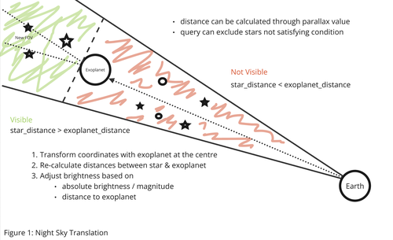
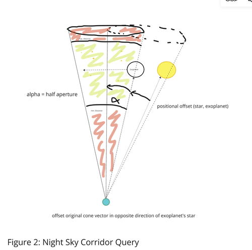
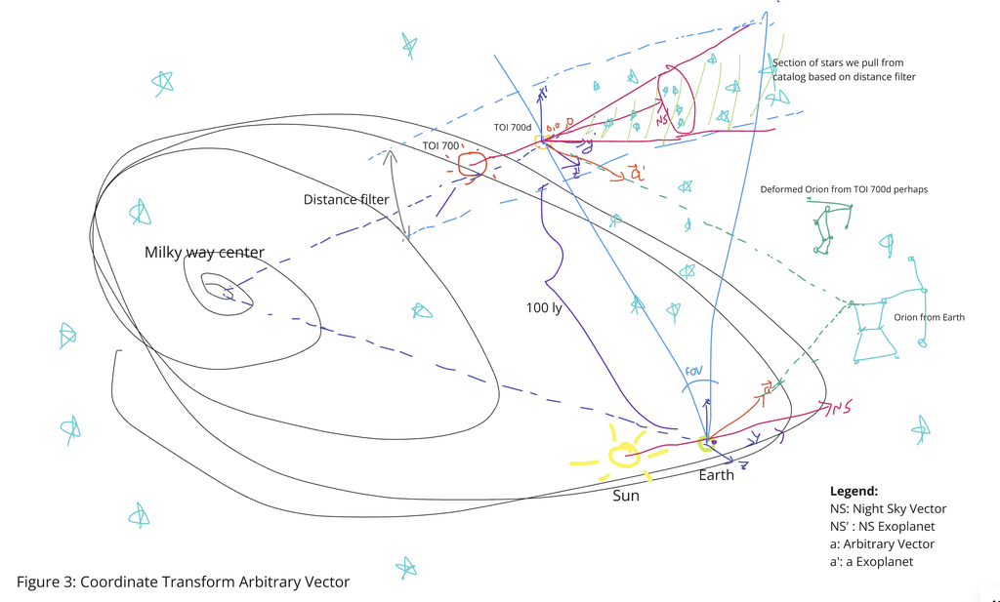
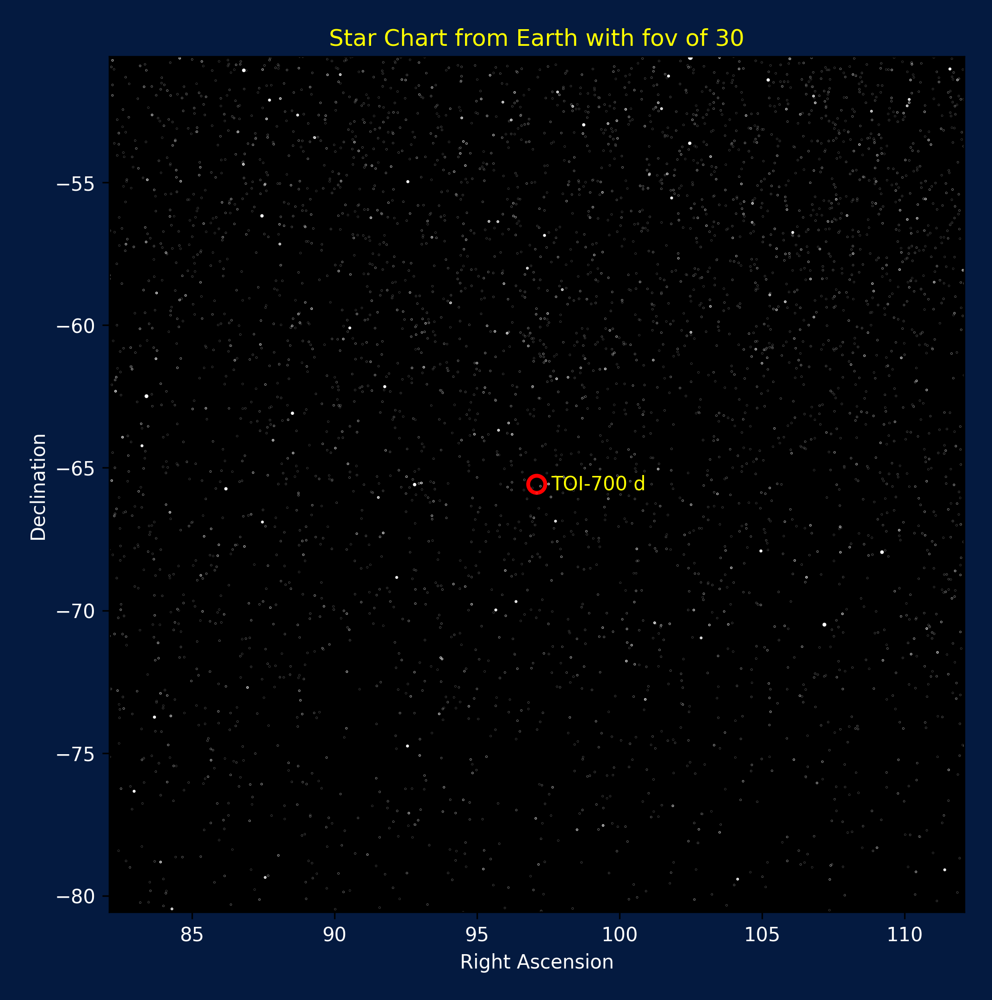
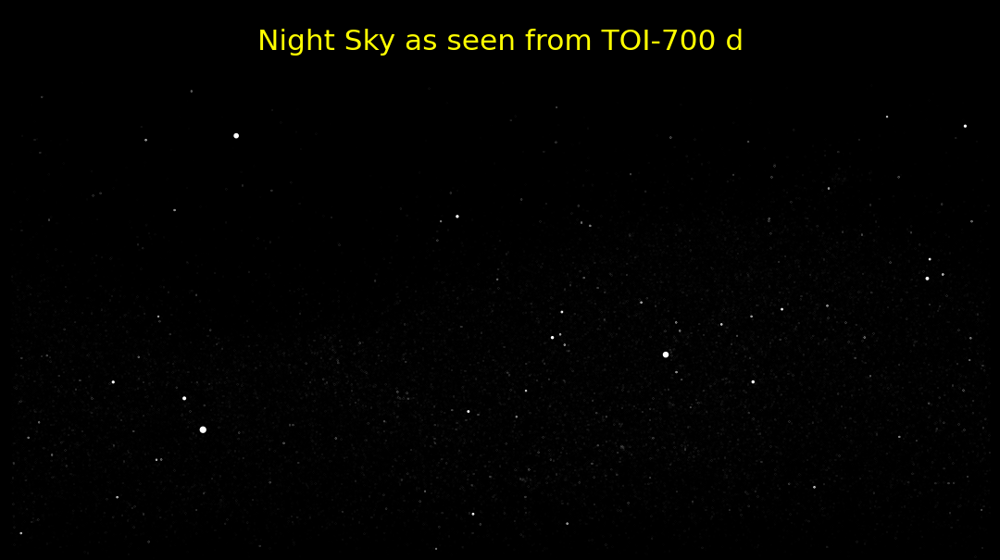
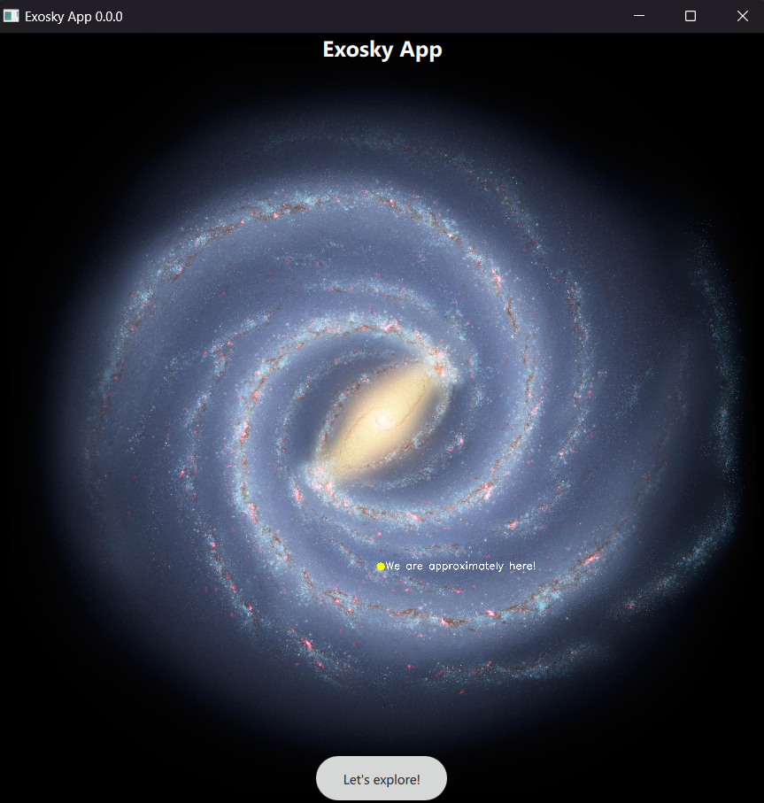
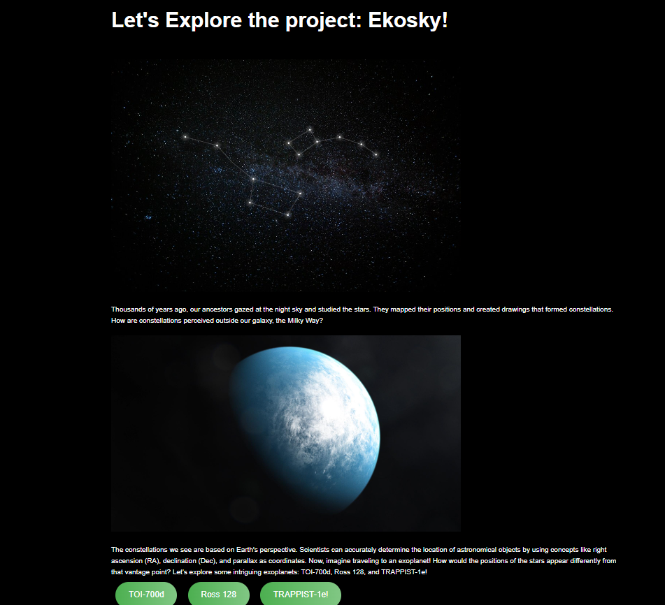

# NASA_SpaceApp_2024
## Exosky!
## Cepheus Team

We developed a web-app to illustrate the differences in perspective when looking at the night sky from different planets. The images can be printed out to allow students to draw their very own constellations onto the image. Perhaps they will find themselves as excited as mankind was when the night sky was still uncharted. Thus, encouraging younger students to learn interactively about the stars and the exoplanets.

## Project Demo
https://docs.google.com/presentation/d/1UmecX0_gAgR4xpWsRoq8rmhLMaz-tQGy/edit?usp=drive_link&amp;ouid=112598267336119579683&amp;rtpof=true&amp;sd=true

## Project Details
Provide additional details about your project. What exactly does it do? How does it work? What benefits does it have? What do you hope to achieve? What tools, coding languages, hardware, or software did you use to develop your project?
See project: https://www.spaceappschallenge.org/nasa-space-apps-2024/find-a-team/three-body-system/?tab=project
See project challenge: https://www.spaceappschallenge.org/nasa-space-apps-2024/challenges/exosky/

## Details
### What exactly does it do?
This project aims to show the night sky as viewed from one of the distant exoplanets. Additionally, the same stars are also shown from earth's perspective to display how change of perspective can change the night sky. Perhaps some new stars are now visible, that were too far away to be seen from earth, or perhaps some stars are now missing as the stars are in-between earth and the exoplanet.

### How does it work?
The user selects an exoplanet from the list of available exoplanets. Then, a query is made to the Gaia star catalogue to get the relevant stars in cone from earth with the exoplanet in the centre. However, as the observer is placed on the far side of the exoplanet's surface, all planets between the exoplanets and earth can be pruned as they will not be visible in the night sky as portrayed in Figure 1. Furthermore, the coordinates in the spherical coordinates given as right ascension (ra) and declination (dec) are transformed into to cartesian coordinate system to allow shifting the centre of the coordinate system to the exoplanet. This allows properly displaying the stars with their new distances to each other, as otherwise the night sky will mostly be just zoomed in. Finally, two 2D image are created to display to the user. One of the night sky from earth with the full untransformed list of stars and another one from the exoplanet's perspective with the transformed filtered list of stars.

### What benefits does it have?
Many images of night skies can be found on the internet, but only few show the night sky from a different perspective and more specifically from a far away exoplanet. This project allows the user to see a night sky which can not be seen from anywhere on earth.

### What do you hope to achieve?
We hope to stimulate the imagination of the user, to inspire them to imagine how it would be like to stand on these distant planets.

### Future Work
The current method does not take into account whether the star in the exoplanet's system is visible at the time, which might mean that the image does not represent a proper night sky.
While multiple approaches may exist, such as simulating the movement of the exoplanet until it is a proper night sky, we propose to change the direction viewed by the observer on the exoplanet as illustrated in Figure 2.
Changing the direction of the observer, leads to the problem that not enough stars might be queried from the database to fill the night sky. As such, moving the search cone away from the star and putting the exoplanet on the cone's edge it will maximize the amount of stars that can be displayed. The corridor's width depends on the minimum and maximum distance of the stars. Finally, while other positional configuration may exist, using the current method or the inverse thereof is enough to display a proper night sky.

Another application of the above mentioned method is viewing the night sky from an arbitrary angle by selecting an appropriate range of distances shown in Figure 3. With a large enough distance filter the visible stars can be captured by the database query filling the night sky from an arbitrarily chosen angle.

## Development
### Tools
- Miro for collaboration
- Gaia Sky for the decoration of the website
- some additional (preliminary) screenshots of space and night skies 
### Coding Languages
- Frontend
  - HTML, CSS, Javascript
  - (QML)
- Backend
  - Python
  - Flask
### Hardware
- Laptops, Desktops
- Google Colab's Server Hardware
### Software
- Jupyter Lab, VS Code, IntelliJ

## Night sky from Earth's perspective, in the direction of TOI-700 d

## Night sky from TOI-700d perspective, after coordinate transformmation

## App Preview

## Web Preview

## Run App in Python
### Create virtual environment with poetry
In vscode terminal:
- cd <path_to_root_of_exosky_repo>
- make sure "pyproject.toml" file is in the repo
- run: poetry config virtualenvs.in-project true
- run: poetry env use <Path_to_python>, whose version should be larger than 3.11 to run astropy.
- run: poetry shell
- run: poetry install

### Add .pth file
In case you encounter error <ModuleNotFoundError>, either:
- run poetry add <missing_package> (afterward run poetry lock --no-update to refresh lock file).
- manually create .pth file in \.venv\Lib\site-packages that contains the <path_to_root_of_exosky_repo>. Sometime this path is not automatically generated, leading Python to not be able to find target folders in repo. 

### Run Exosky App
There are two ways to run:
- run in terminal: python.exe app_interface/exosky_app.py
- run in "RUN AND DEBUG" vscode channel after selecting "Exosky App" from drop-down.

Space Agency Data
- [NASA Exoplanet Archive](https://exoplanetarchive.ipac.caltech.edu)
- [Gaia ESA Archive](https://gea.esac.esa.int/archive/)

References
- [Create Custom Star Maps](https://levelup.gitconnected.com/how-to-use-python-to-create-custom-star-maps-for-your-next-stargazing-journey-9908b421f30e)
- [astropy](https://docs.astropy.org/en/stable/index_user_docs.html)
- [Miro - a digital collaboration platform](https://miro.com)
- [Sexigesimal to Decimal Coordinate Converter](https://www.swift.psu.edu/toop/convert.php)
- [Gaia Sky](https://zah.uni-heidelberg.de/gaia/outreach/gaiasky)
- [Illustrative images of Exoplanet](https://images.nasa.gov/)